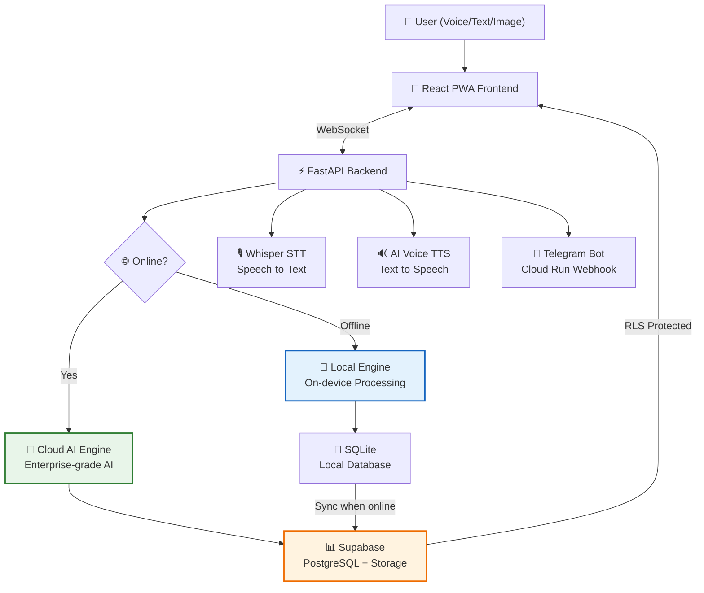
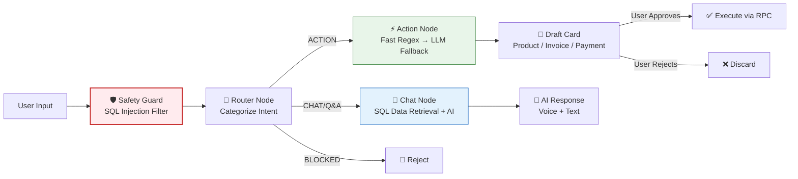

# 🏪 DukanSathi AI

> **Smart Voice-first inventory & billing assistant for Indian shopkeepers.**  
> Say it in Hindi, Hinglish, or English — manage your dukan effortlessly.

[](https://dukansathi.vercel.app)
[](https://dukansathi.com)
[]()

---

## 📑 Table of Contents

- [Architecture](#-architecture-hybrid-openclaw-engine)
- [Features](#-features)
- [Tech Stack](#-tech-stack)
- [Project Structure](#-project-structure)
- [Quick Start (Local)](#-quick-start-local)
- [Environment Variables](#-environment-variables)
- [Deployment](#-deployment)
- [Database Migrations](#-database-migrations)
- [AI Command Reference](#-ai-command-reference)
- [API Reference](#-api-reference)
- [Security](#-security)
- [Troubleshooting](#-troubleshooting)

---

## 🏗️ Architecture: Hybrid OpenClaw™ Engine

DukanSathi is built on a **Hybrid-Edge** architecture that intelligently balances cloud power with local privacy and performance.

### System Architecture



### AI Agent Pipeline (LangGraph)



---

## 🚀 Features

| Feature | Status |
|---------|--------|
| 🎤 Voice input (Hindi / Hinglish / English) | ✅ |
| 📦 Product management (add, edit, restock, image upload) | ✅ |
| 👤 Customer management (add, track dues, GST fields) | ✅ |
| 🧾 Invoice / bill creation via AI (PDF generation) | ✅ |
| 💸 Payment recording & dues tracking (udhar/jama) | ✅ |
| 📊 Sales dashboard with profit margins | ✅ |
| 🔴 Low-stock alerts | ✅ |
| 📷 Excel/CSV bulk product import (image & file) | ✅ |
| 🔊 AI voice responses (10+ Indian voices) | ✅ |
| 📲 WhatsApp invoice sharing (PDF + text summary) | ✅ |
| 🤖 Telegram bot integration | ✅ |
| 🌐 Storefront — customer-facing order bot | ✅ |
| 🔒 Private invoice storage (signed URLs) | ✅ |
| 🛡️ SQL injection protection (regex guard) | ✅ |
| ⚡ WebSocket rate limiting | ✅ |
| 🔄 Offline mode (SQLite synchronization) | ✅ |

---

---

---

## 🛠️ Tech Stack

| Layer | Technology |
|-------|-----------|
| **Frontend** | React 18 + Vite 6 (Vanilla CSS, Mobile-first) |
| **Backend** | FastAPI 0.115 (Python 3.11+) |
| **AI (Cloud)** | Enterprise-grade LLM |
| **AI (Local)** | Lightweight Edge LLM |
| **Agent Framework** | LangGraph (multi-node state machine) |
| **Speech-to-Text** | Whisper STT |
| **Text-to-Speech** | AI Voice Engine (10+ voices) |
| **Database** | Supabase (PostgreSQL + RLS + Storage) |
| **Offline DB** | SQLite (local-first) |
| **Auth** | Supabase Auth (Google OAuth + OTP) |
| **Bot** | Telegram Bot API |
| **Frontend Deploy** | Vercel |
| **Backend Deploy** | Google Cloud Run / Render |

---

## 📁 Project Structure

```
dukanv22/
├── backend/                    # FastAPI server
│   ├── main.py                 # Entry point: WebSocket, REST, CORS, Rate Limiting
│   ├── voice_service.py        # STT (Groq Whisper) + TTS (Edge-TTS)
│   ├── local_ai.py             # Ollama local LLM integration
│   ├── local_db.py             # SQLite offline database
│   ├── security.py             # Rate limiting & security headers middleware
│   ├── telegram_bot.py         # Telegram bot handler (webhook + polling)
│   ├── setup_routes.py         # System setup endpoints
│   └── requirements.txt
│
├── ai-bot/
│   └── dukansathi_ai/
│       ├── agent_graph.py      # LangGraph AI agent (router → action/chat nodes)
│       └── language_detector.py # Hindi/English detection
│
├── frontend/
│   └── src/
│       ├── pages/
│       │   ├── Chat.jsx        # AI chat (voice, image, PDF invoices)
│       │   ├── Dashboard.jsx   # Sales overview & analytics
│       │   ├── Inventory.jsx   # Product management + image upload
│       │   ├── Customers.jsx   # Customer list & dues tracking
│       │   ├── Sales.jsx       # Invoice history & management
│       │   ├── Settings.jsx    # Voice, profile, AI model selection
│       │   ├── Connections.jsx # Telegram bot linking
│       │   ├── StoreFront.jsx  # Customer-facing order bot
│       │   └── Landing.jsx     # Marketing landing page
│       ├── components/
│       │   ├── ActionCard.jsx  # Draft approval UI (product/invoice/payment)
│       │   ├── BottomNav.jsx   # Mobile bottom navigation
│       │   ├── NavigationDrawer.jsx # Sidebar navigation
│       │   └── VoiceAssist.jsx # Voice recording component
│       ├── hooks/
│       │   ├── useChat.js      # WebSocket + TTS + chat state
│       │   └── useOnlineStatus.js # Network connectivity detection
│       └── contexts/
│           └── AuthContext.jsx # Supabase auth provider
│
├── migrations/                 # Supabase SQL migrations (001–016 + telegram)
├── setup_invoices_bucket.sql   # Private invoice storage setup
├── Dockerfile                  # Backend Docker image
├── vercel.json                 # Frontend deploy config
├── render.yaml                 # Backend deploy config (Render fallback)
└── SECURITY.md                 # Security policy & practices
```

---

## 🚀 Quick Start (Local)

### Prerequisites
- Python 3.11+
- Node.js 18+
- A [Supabase](https://supabase.com) project

### 1. Clone & Install

```bash
git clone https://github.com/mazi3012/dukansathi-monorepo.git
cd dukansathi-monorepo

# Backend
cd backend
python -m venv venv
# Windows: .\venv\Scripts\Activate.ps1
# Mac/Linux: source venv/bin/activate
pip install -r requirements.txt

# Frontend
cd ../frontend
npm install
```

### 2. Environment Variables

**`backend/.env`** — create from `backend/.env.example`:
```env
SUPABASE_URL=https://YOUR_PROJECT_ID.supabase.co
SUPABASE_SERVICE_KEY=your_service_role_key
GROQ_API_KEY=your_groq_key
GOOGLE_APPLICATION_CREDENTIALS=service_account.json
FRONTEND_URL=http://localhost:5173
PORT=8000
```

**`frontend/.env.local`**:
```env
VITE_SUPABASE_URL=https://YOUR_PROJECT_ID.supabase.co
VITE_SUPABASE_ANON_KEY=your_anon_key
VITE_BACKEND_WS_URL=ws://localhost:8000/ws/chat
VITE_BACKEND_URL=http://localhost:8000
```

> ⚠️ **Production** must use `https://` and `wss://` — never use `http://` or `ws://` in production.

### 3. Run Migrations

Run SQL files in `migrations/` from `001` to `016` in order via Supabase SQL Editor.

### 4. Start Servers

```bash
# Terminal 1 — Backend
cd backend
python main.py
# → http://localhost:8000

# Terminal 2 — Frontend
cd frontend
npm run dev
# → http://localhost:5173
```

---

## 🔐 Environment Variables

### Backend (`backend/.env`)

| Variable | Required | Description |
|----------|----------|-------------|
| `SUPABASE_URL` | ✅ | Supabase project URL |
| `SUPABASE_SERVICE_KEY` | ✅ | Service role key (**never expose to frontend**) |
| `GROQ_API_KEY` | ✅ | Groq Whisper STT key |
| `GOOGLE_APPLICATION_CREDENTIALS` | ✅ | Path to service account JSON for Vertex AI |
| `FRONTEND_URL` | ✅ | Allowed frontend origin for CORS |
| `TELEGRAM_BOT_TOKEN` | Optional | Telegram bot token |
| `TELEGRAM_BOT_USERNAME` | Optional | Telegram bot username |
| `WEBHOOK_URL` | Optional | Cloud Run URL for Telegram webhooks |
| `PORT` | Optional | Server port (default: 8000) |

### Frontend (`frontend/.env.local`)

| Variable | Required | Description |
|----------|----------|-------------|
| `VITE_SUPABASE_URL` | ✅ | Supabase project URL |
| `VITE_SUPABASE_ANON_KEY` | ✅ | Supabase anon/public key |
| `VITE_BACKEND_WS_URL` | ✅ | WebSocket URL (`ws://` local, `wss://` production) |
| `VITE_BACKEND_URL` | ✅ | REST API base URL |

---

## 🚢 Deployment

### Frontend → Vercel

- Auto-deploys on push to `main`
- Build: `cd frontend && npm run build`
- Output: `frontend/dist`
- Config: [`vercel.json`](vercel.json)

### Backend → Google Cloud Run (Primary)

- Docker-based deployment via `Dockerfile`
- Set all environment variables in Cloud Run console
- Telegram webhook auto-configures on startup

### Backend → Render (Fallback)

- Auto-deploys on push to `main`
- Config: [`render.yaml`](render.yaml)

> **Post-deploy:** Set `FRONTEND_URL` to your Vercel URL in the backend environment.

---

## 📊 Database Migrations

Run SQL files in `migrations/` in order via Supabase SQL Editor:

| File | Description |
|------|-------------|
| `001` | User profiles schema |
| `002` | AI helper functions + suppliers |
| `003–005` | Products, customers, sales tables |
| `006–008` | Purchase orders, chat history, drafts, inventory logs |
| `009` | Product images support |
| `010` | Customer GST fields |
| `011` | Product schema fixes |
| `012` | Auto-update customer balance trigger |
| `013` | AI helper RPCs + profile settings |
| `014–015` | Payment & credit RPCs |
| `016` | Product image URL column |
| `telegram_*` | Telegram bot connection tokens |

---

## 🗣️ AI Command Reference

The AI understands natural Hindi/Hinglish/English commands:

### Products
```
"Add Maggi price 20 stock 100"
"New product milk 50 rupees, cost 35"
"Restock 50 rice"
```

### Customers
```
"Add customer Rohit"
"New customer Priya phone 9876543210"
```

### Dues & Payments
```
"Add 500 due to Amit"          → adds ₹500 credit (red)
"Deduct 300 from Rahul due"    → deducts ₹300 (green)
"Rahul paid 1000"              → records ₹1000 payment
"Received 200 from Seema"      → records ₹200 payment
```

### Invoices
```
"Bill for Amit 2 rice and 1 oil"
"Create invoice for Raj 3 Maggi"
```

### Bulk Import
```
Upload an Excel/CSV file → AI extracts all products
Upload a photo of a price list → AI reads via OCR
```

---

## 📡 API Reference

### REST Endpoints

| Method | Path | Description |
|--------|------|-------------|
| `GET` | `/` | Health check |
| `GET` | `/health` | Detailed health (DB, AI, Telegram status) |
| `POST` | `/api/tts-preview` | Generate TTS audio preview |
| `POST` | `/upload-product-image` | Upload product photo |
| `GET` | `/api/telegram/bot-link` | Get Telegram bot URL |
| `POST` | `/api/telegram/webhook` | Telegram webhook receiver |
| `GET` | `/api/local/*` | Offline data endpoints |
| `GET` | `/api/setup/*` | System setup routes |

### WebSocket `/ws/chat`

Rate limited to **30 connections/minute per IP**.

**Client → Server:**
```json
{ "type": "text", "content": "Add customer Rahul", "user_id": "...", "model": "gemini-3.1-flash-lite-preview" }
{ "type": "voice", "content": "<base64_audio>", "voice_id": "en-IN-PrabhatNeural" }
{ "type": "image", "content": "<base64_image>" }
{ "type": "excel", "content": "<base64_file>", "filename": "products.xlsx" }
{ "type": "action", "action": "approve_customer", "draft_data": { ... } }
```

**Server → Client:**
```json
{ "type": "text", "content": "Done!", "audio": "<base64_mp3>", "attachment": { "draft_type": "customer", ... } }
{ "type": "transcription", "content": "Add customer Rahul" }
{ "type": "image_pending", "content": "Image received! Tell me what to do." }
{ "type": "error", "content": "Something went wrong." }
```

---

## 🔒 Security

- **No hardcoded secrets** — all credentials via environment variables
- **Private invoice storage** — PDFs stored in private Supabase bucket, accessed via time-limited signed URLs
- **SQL injection protection** — regex-based pattern matching blocks destructive queries
- **WebSocket rate limiting** — 30 connections/minute per IP
- **Sanitized error messages** — no stack traces or internal details leaked to clients
- **Row-Level Security** — Supabase RLS policies enforce user-scoped data access
- **CORS restriction** — only whitelisted origins are allowed
- **Authentication required** — AI agent rejects unauthenticated requests

See [`SECURITY.md`](SECURITY.md) for full security policy and incident response procedures.

---

## 🐛 Troubleshooting

### WebSocket not connecting
1. Check backend is running: `curl http://localhost:8000/health`
2. Verify `VITE_BACKEND_WS_URL` in `frontend/.env.local`
3. Check CORS errors — add your origin to `ALLOWED_ORIGINS` in `backend/main.py`

### AI response not showing
- Check `backend.log` for AI response logs
- Ensure the AI engine is accessible

### Voice not working
- Ensure Speech-to-Text service is active
- Check browser microphone permissions
- Try a different voice in Settings

### Supabase RLS blocking requests
- Backend must use **service role key** (not anon key)
- Frontend uses anon key with user-scoped RLS policies

---

## 👥 Contributing

1. Fork the repo
2. Create feature branch: `git checkout -b feature/my-feature`
3. Commit: `git commit -m "feat: add my feature"`
4. Push and open a PR

See [`SECURITY.md`](SECURITY.md) for responsible disclosure of vulnerabilities.

---

## 📄 License

Proprietary — Dukan Sathi Team 2026

---

*Built with ❤️ for Indian shopkeepers*
