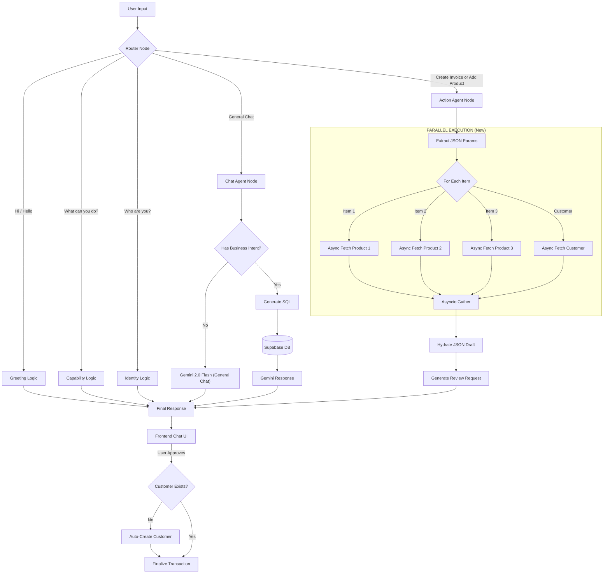

# Dukan Sathi Agentic System Architecture

This diagram visualizes the flow of the Moltbot Agent, highlighting the **new Parallel Search** capability.

## Key Improvements
1.  **Parallel Execution**: The "Async Fetch" nodes now run simultaneously, reducing wait time from $O(N)$ to $O(1)$.
2.  **Auto-Create**: The Frontend now handles new customers automatically during the approval phase.
