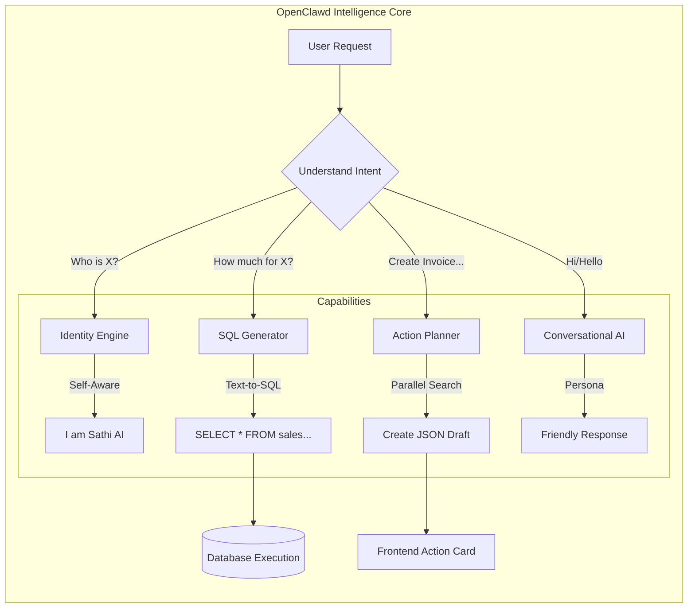

# What OpenClawd (The AI Core) Does

OpenClawd acts as the **Intelligence Layer** of your Dukan Sathi application. It bridges the gap between natural language (what you say) and structured data (your database).

## Core Responsibilities Diagram

## Key Functions

### 1. Intent Recognition (The Brain)
It decides *what* you are asking for.
-   **Conversation:** "Hello", "How are you?" -> Routed to Chat.
-   **Data Query:** "Show me sales" -> Routed to SQL Generator.
-   **Action:** "Create bill" -> Routed to Action Planner.

### 2. Parallel Data Fetching (The Speed)
When you ask for complex actions (e.g., "Bill for Rahul: 2 Rice, 1 Oil"), OpenClawd now:
-   Splits the request into parts.
-   **Fetches all product details simultaneously** (Parallel Execution).
-   Assembles the final draft instantly.

### 3. Verification & Safety
-   It ensures you don't execute dangerous SQL commands.
-   It verifies products exist before adding them to a bill.
-   It formats data strictly as JSON for the frontend to render.
